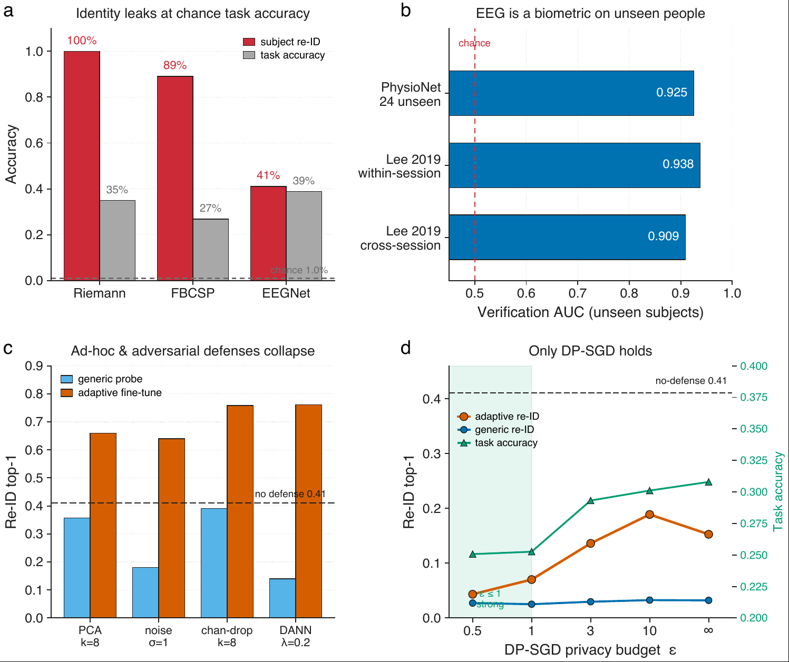
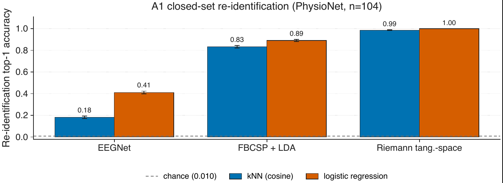
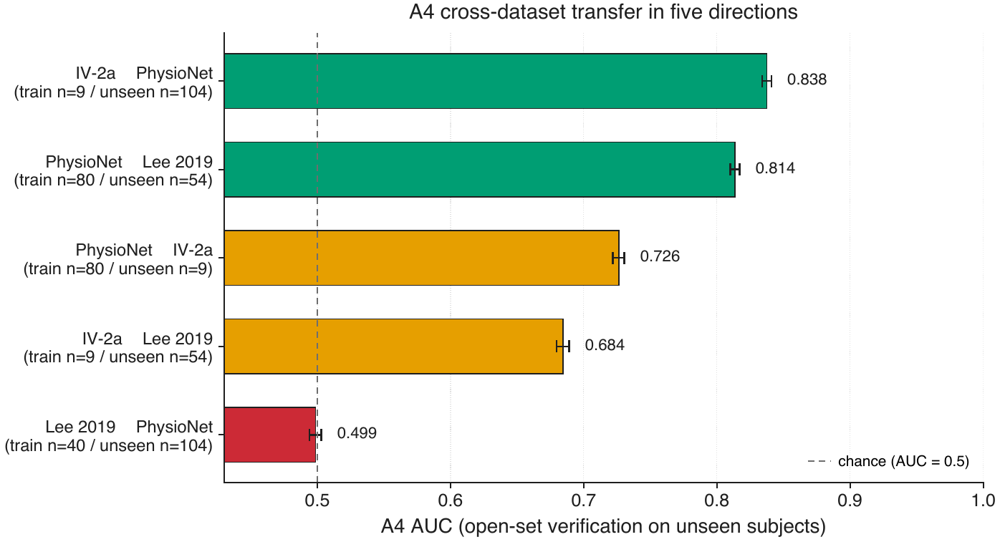
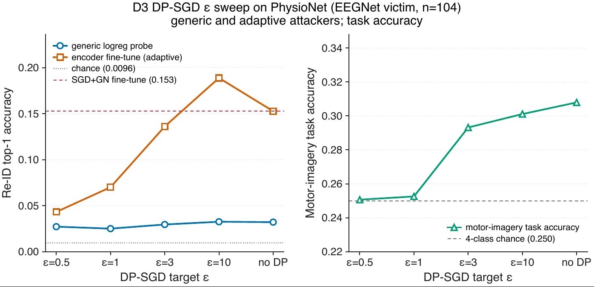

# Subject Re-Identification Leakage in Motor-Imagery BCI Models

> **Paper:** [`paper/mondair_bci_identity_leakage.pdf`](paper/mondair_bci_identity_leakage.pdf)

A reproducible benchmark of subject-identifying information leaked from
machine-learning brain–computer interface (BCI) models trained for
motor-imagery decoding, together with four families of defenses
evaluated under matched generic *and* adaptive attackers. Three EEG
corpora, thirty-three numbered experiments, 1000-resample trial-grouped
bootstrap CIs, and a 273-invariant audit on every commit.

## Key results

<p align="center"></p>

**Figure 1.** Motor-imagery BCI decoders leak subject identity that is
**(a)** decoupled from task accuracy — Riemannian features re-identify all 104
PhysioNet subjects at 100% while decoding the task at 35%; **(b)** a biometric on
*unseen* people, verifying held-out subjects at AUC 0.92–0.94 on two independent
corpora; **(c)** recoverable through every ad-hoc and adversarial defense once the
attacker adapts (fine-tuning the defended encoder); and **(d)** contained only by
DP-SGD, and only at a strong privacy budget (ε ≤ 1).

<p align="center">
  <a href="figures/02_closed_set_reid.pdf"></a>
  <a href="figures/26_a4_xds_symmetric.pdf"></a>
  <a href="figures/29_d3_eps_sweep.pdf"></a>
</p>

*Left → right: closed-set re-identification per decoder family; cross-dataset
verification in five directions (one collapses to chance — a direction-dependent
asymmetry); the DP-SGD privacy–utility frontier under generic and adaptive
attackers. Every figure regenerates from `results/*.json` via
`python -m tools.regenerate_figures`; the full set is in [`figures/`](figures/).*

## Installation

```bash
git clone https://github.com/manrajmondair/bci-identity-leakage
cd bci-identity-leakage
python3.11 -m venv .venv && source .venv/bin/activate
pip install -e ".[dev]"
```

## Reproducing the results

```bash
python -m tools.audit                # 273 invariants on results/*.json
python -m tools.regenerate_figures   # rebuild every figure from results/
```

Classical baselines (FBCSP, Riemann; experiments 02, 04, 11, fairness)
run on CPU in under an hour. Deep-learning experiments (EEGNet,
contrastive embedder, DANN, DP-SGD, federated DP, shadow MI, every
adaptive attacker, all Lee 2019 experiments) run on a Colab L4 or A100;
see [`colab/`](colab/) for one self-contained notebook per experiment.

## Repository layout

```
paper/         Final paper (PDF)
attacks/       A1–A5 attack code + adaptive variants
defenses/      D1 ad-hoc, D2 DANN, D3 DP-SGD, D4 federated DP-FedAvg
models/        FBCSP+LDA, Riemann tangent-space + LR, EEGNet, contrastive EEGNet
preprocess/    4–40 Hz bandpass, 2-s sliding windowing, disk-cached
data/          PhysioNet / IV-2a / Lee 2019 loaders + parallel prefetchers
eval/          trial-grouped bootstrap CIs, plotting helpers
experiments/   33 numbered, one-per-claim entry points
tools/         audit, figure regeneration, Pareto, subgroup fairness
colab/         one notebook per experiment
results/       canonical JSON outputs
figures/       publication-grade PDFs (regenerated from JSON)
runs/          per-experiment execution provenance
```

## Datasets

| Dataset | Subjects | Channels | Rate | Loader |
|---|---|---|---|---|
| PhysioNet EEG-MMIDB | 109 → 104 used | 64 (10-10) | 160 Hz | [`data.physionet_loader`](data/physionet_loader.py) |
| BCI Competition IV-2a | 9 × 2 sessions | 22 | 250 Hz | [`data.bciiv2a_loader`](data/bciiv2a_loader.py) |
| Lee 2019 OpenBMI | 54 × 2 sessions | 62 (10-10) | 1000 Hz native | [`data.lee2019_loader`](data/lee2019_loader.py) |

PhysioNet demographic metadata is sourced from the OpenNeuro ds004362
BIDS sibling; see [`data/external/`](data/external/).

## Citation

If you use this work, please cite:

```bibtex
@misc{mondair2026bcileakage,
  title  = {Subject Re-Identification Leakage in Motor-Imagery BCI Models},
  author = {Mondair, Manraj Singh},
  year   = {2026},
  url    = {https://github.com/manrajmondair/bci-identity-leakage}
}
```

A machine-readable `CITATION.cff` is provided at the repository root.

## License

Code in this repository is released under the MIT License — see
[`LICENSE`](LICENSE). Each dataset retains its original license:
PhysioNet EEG-MMIDB (ODbL), BCI Competition IV-2a (CC-BY), Lee 2019
OpenBMI (CC-BY 4.0), OpenNeuro ds004362 (CC0).
